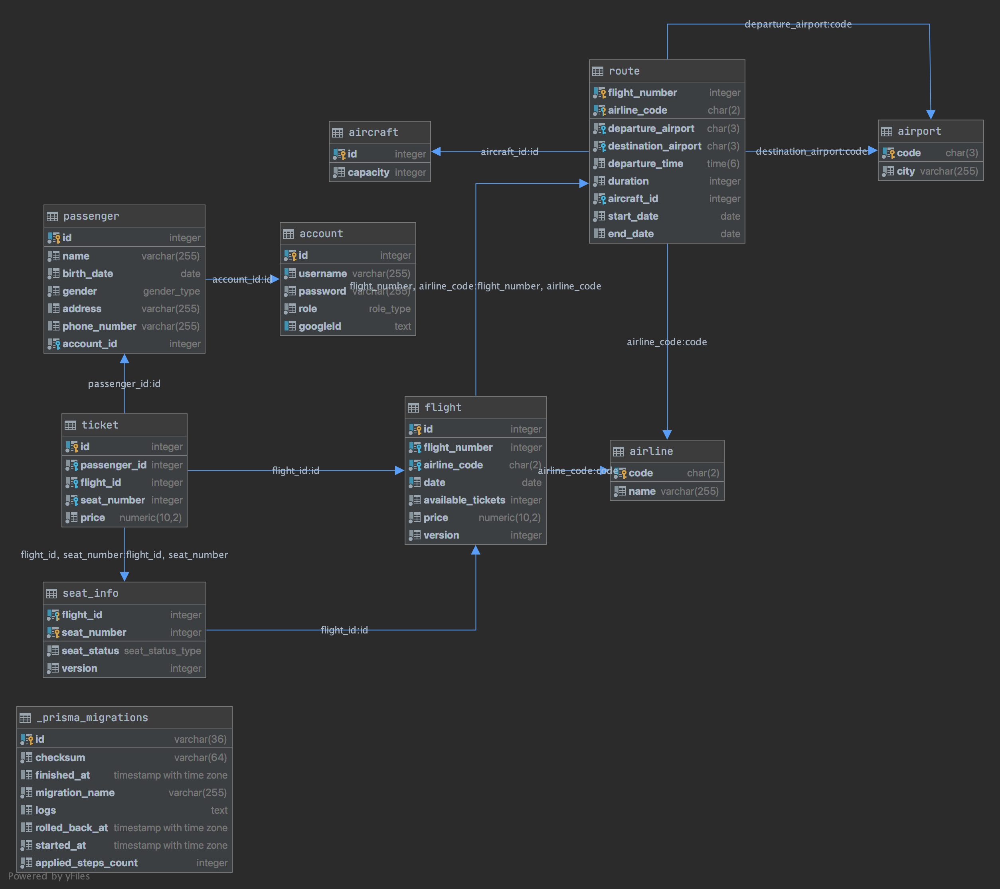

# Flight Booking System —— FlightGo

Deployed with DigitalOcean:

`https://flightgo-qnfvw.ondigitalocean.app/`

## Table of Contents

- [Objectives](#objectives)
- [Technical Stack](#technical-stack)
- [User Guide](#user-guide)
- [Development Guide](#development-guide)
- [Contribution Guidelines](#contribution-guidelines)

---

## Objectives

FlightGo aims to create a smooth and efficient flight ticket booking system that enhances user experience through simplicity, speed, and reliability. Our objective is to develop a full-featured platform where users can easily search for flights, select seats, book tickets, and receive automated email confirmations. Additionally, an admin panel will be included for managing flights and bookings.

By leveraging modern web technologies, FlightGo ensures that the booking process remains intuitive and accessible, minimizing user frustration and maximizing convenience.

---

## Technical Stack

- Frontend:
  - React
  - TypeScript
  - Tailwind CSS and Shadcn/ui for a modular, responsive UI
- Backend:
  - Framework: Express.js Server with RESTful API Design
  - Authentication and Authorization (**Advanced Feature - User Authentication and Authorization, API Integration with External Services**):
    - Token Management:
      - JWT tokens are generated upon successful login/registration
      - Tokens contain encrypted user information (id, role)
      - Tokens are stored in the client's Local Storage
      - Each API request requiring authentication includes the token in the Authorization header
    - Security Measures:
      - Tokens are signed with a secret key stored securely on the server
      - Authentication middleware verifies token validity for protected routes
      - Authorization middleware enforces role-based access control
      - Invalid or expired tokens result in 401 Unauthorized responses
      - Insufficient permissions result in 403 Forbidden responses
    - API Integration: Integrate to Google OAuth 2.0 for login
  - Cloud Storage (**Advanced Feature - File Handling and Processing, API Integration with External Services**): Digital Ocean Spaces Object Storage with pdf file by PDFKit
  - API Documentation: Generated by Swagger and documented using JSDoc comments in route classes
  - Database: PostgreSQL with Prisma
    

---

## User Guide

> Note: some images below are GIF animations, not static images.

> pre-populated data can be found in /seed.log

### Registration & Login

- Register as either admin or user.
- After registration, you are automatically logged in.

#### Test Credentials

| Role   | Email             | Password |
| ------ | ----------------- | -------- |
| Admin  | admin@example.com | admin123 |
| User 1 | user@example.com  | user123  |
| User 2 | user2@example.com | user456  |


---

### Admin Operations (Only accessible by admin account)

Go to the admin dashboard to manage all core resources.

- For a complete create flight operation, please follow the following order:
  - Create a aircraft, airline, airport first (no dependency)
  - Create a route with the created aircraft, airline, airport
  - Create a flight with the created route

#### Flights CRUD

Admins can create, read, update, and delete flights. Use the left pannel, search the flights you want to operate.


#### Add Aircraft

Enter aircraft number and available seats.


#### Add Airport

Enter airport code and the corresponding city.


#### Add Airline

Enter the airline code and airline name.


#### Add Route

Enter a unique flight number, select airline, set start/end dates, and other route details.  
Flights will be generated within this time window.

> Note: the start date and end date are for flight availability (operation time, eg. one flight will run on summer season only), unrelated to the duration of a single flight.


#### Add Flight

Select an existing route and input departure date.  
Available tickets must be equal to the aircraft's seat capacity.


---

### Flight Search

#### Sample Flight Data

| Airline                | Route     | Description             | Operating Period         |
| ---------------------- | --------- | ----------------------- | ------------------------ |
| American Airlines (AA) | JFK → LAX | New York to Los Angeles | 2025-04-06 to 2025-04-12 |
| American Airlines (AA) | LAX → JFK | Los Angeles to New York | 2025-04-06 to 2025-04-12 |

#### Search Features

- Choose one way or round trip
- Enter origin and destination — autocomplete and input suggestions are enabled
- Select departure date
- Use filters for airlines and price range

> Note: Input validations are in place to prevent incorrect submissions


---

### Round Trip Flow

- After filling the search details:
  - Select outbound flight
  - Then select return flight
  - Choose seats for both flights

Seat status:

- BOOKED: already taken
- AVAILABLE: ready to choose
- UNAVAILABLE: not selectable


---

### Booking Demo

- Select an existing passenger or create a new passenger.
- Fill in passenger details to proceed.
- Click confirm booking to lock in your seat.
- On the notification page, download your PDF invoice.


---

### Flight Management

Click the home button in the navbar to:

- View your bookings
- Change seat selection
- Cancel bookings


---

### User Profile

Click your username in the navbar to access your profile:

- View passengers under your account
- Edit or add new passenger profiles


---

## Development Guide

### Docker Instructions

If you use Docker to run the application:

1. Start the application:

```bash
docker-compose up --build
```

2. Stop the application (keeping containers):

```bash
docker-compose stop
```

3. Stop and remove containers, networks, and volumes:

```bash
docker-compose down
```

### Local Development Setup

> The following guide has been tested on:
>
> MacOS:
>
> - Node.js: v20.15.0
> - npm: 10.7.0
> - PostgreSQL: 14.16 (Homebrew)
>
> Windows PowerShell:
>
> - Node.js: v20.17.0
> - npm: 10.8.2
> - PostgreSQL x64: 17.3
>
> Verified Browser:
>
> - Chrome

```
git clone https://github.com/yiyangww/FlightGo.git
```

```
cd ECE1724ReactProject
```

### Database Setup

#### Install PostgreSQL and create the database

1. Download and install PostgreSQL from https://www.postgresql.org/download/

   - Mac/Linux Setup via Homebrew:

     ```
     /bin/bash -c "$(curl -fsSL https://raw.githubusercontent.com/Homebrew/install/HEAD/install.sh)"
     brew install postgresql
     ```

     start psql

     ```
     brew services start postgresql
     ```

     or if your version is 16:

     ```
     brew services start postgresql@16
     ```

   - Windows Setup: Download and run the installer to install and start PostgreSQL

2. Create a new database named `airline_reservation_system`:
   ```
   createdb airline_reservation_system
   ```
   > Note: On Windows, if you don't know the PostgreSQL password for your Windows username,
   > use the following command instead (the installer only sets up the password for the `postgres` user):
   >
   > ```
   > createdb airline_reservation_system -U postgres
   > ```

#### Set up the Prisma schema

Under `backend` folder:

```
cd backend
```

1. Install dependencies:

   ```
   npm install
   ```

2. For convenience, we provide `.env.dev` for local development. Simply copy it to `.env` and update the database credentials. For custom Google OAuth 2.0 and DigitalOcean Spaces configuration, use `.env.example` as a template.

   ```
   cp .env.dev .env
   ```

   > Note: You need to chenge `username` to your psql username, `password` to your psql password.

   > And `.env.production` is also provided for an example of the production environment in Guanhong's personal server.

3. Run the migration:

   ```
   npx prisma migrate dev --name init
   ```

   This creates and runs the SQL migration file and generates an Entity Relationship Diagram.

4. Verify the setup:
   - Check for `backend/prisma/migrations/<yyyyMMddHHmmss>_init/migration.sql`
   - Verify `backend/prisma/ERD.svg` exists
   - Confirm tables are created in the `airline_reservation_system` database

> Reset and re-create the prisma schema (Optional, only if you want to reset the database from a previous schema)
>
> 1. Delete `backend/prisma/migrations` folder.
> 2. Reset the prisma schema
>    ```
>    npx prisma migrate reset
>    ```
> 3. Re-create the prisma schema
>    ```
>    npx prisma migrate dev --name init
>    ```

### Run the Backend Server after Database Setup

Under `backend` folder:

1. Install dependencies
   ```
   npm install
   ```
2. Start the server
   ```
   npm start
   ```
   OR
   ```
   npm run dev
   ```
3. Access the backend API documentation at `http://localhost:3000/swagger`
   ```
   http://localhost:3000/swagger
   ```

### Test Backend APIs Manually after Database Setup and Server Start

1. Under `backend` folder, run the seed script to clean up any existing data and populate some basic data for testing. <br/>
   The seed script will create one admin account `admin@example.com` with password `admin123` and two users `user1@example.com` with password `user123` and `user2@example.com` with password `user456`.
   > Note: This step is optional, you can skip it if you do not want to populate data. Also, the seed script does not reset the database, so the id will increase in each run.
   > You can check the [seed.log](https://github.com/GuanhongW/ECE1724ReactProject/blob/031fa48c0640f68aa022cb50e87b5bbfeaca27e6/seed.log) file or your terminal output for the created data that can be used to test our application.
   ```
   npm run seed
   ```
2. After run the seed script, you can test the APIs by using the [Postman Collection](#postman-collection-demo) or access the swagger UI at `http://localhost:3000/swagger` to test the APIs.

### Frontend Setup

Under `frontend` folder:

```
cd frontend
```

1. Install dependencies

   ```
   npm install
   ```

2. copy .env.dev to your .evn

   ```
   cp .env.dev .env
   ```

3. Start the frontend server
   ```
   npm run dev
   ```
4. Access the frontend at `http://localhost:5173`
   ```
   http://localhost:5173
   ```

### Postman Collection Demo

#### 1. Create a Workspace

Start by creating a new workspace in Postman.

#### 2. Import API Collection

Import the `FlightGo_API.postman_collection.json` file into your workspace.

#### 3. Create an Environment

In the top-left corner, create a new environment.  
The environment is used to store the authentication token after login (the token is automatically saved via the Postman script in the login API's response).

> Note:  
> You must run the `Login API` first to authenticate and get the token before accessing other APIs.

#### API Usage Made Easy

All sample inputs (parameters, request bodies) are pre-configured.  
As a developer, you do not need to manually input anything — just select the API you want to test and click Send.


## Contribution Guidelines

We welcome contributions to FlightGo! This document outlines the process and guidelines for contributing to the project.

### Getting Started

1. Fork the repository
2. Clone your fork:
   ```bash
   git clone https://github.com/YOUR-USERNAME/ECE1724ReactProject.git
   ```
3. Set up your development environment following the [Development Guide](#development-guide)
4. Create a new branch for your feature/fix:
   ```bash
   git checkout -b feature/your-feature-name
   ```

### Development Process

1. Make your changes following our coding standards:

   - Use TypeScript for frontend development
   - Follow the existing code style and patterns
   - Write clear, descriptive commit messages
   - Add comments for complex logic
   - Update documentation as needed

2. Test your changes:

   - Test with [swagger editor](https://editor.swagger.io/), import /openapi.json
   - Test using the [Postman Collection](#postman-collection-demo)
   - Write your own test cases

3. Commit your changes:

   ```bash
   git add .
   git commit -m "Description of your changes"
   ```

4. Push to your fork:
   ```bash
   git push origin feature/your-feature-name
   ```

### Pull Request Process

1. Create a Pull Request (PR) from your fork to the main repository
2. Ensure your PR description clearly describes the problem and solution
3. Include the relevant issue number if applicable
4. The PR will be reviewed by our team members
5. Address any feedback or requested changes
6. Once approved, your PR will be merged

### Code Review Guidelines

- All code must be reviewed by at least one team member
- Code should be well-documented and follow our coding standards
- Tests should be included for new features
- The PR should not introduce any new linting errors
- The changes should be focused and not include unrelated modifications

### Questions or Problems?

If you have any questions or run into problems, please:

1. Check the [Development Guide](#development-guide)
2. Open an issue in the repository
3. Contact the team members listed in [Team Information](#team-information)

---
